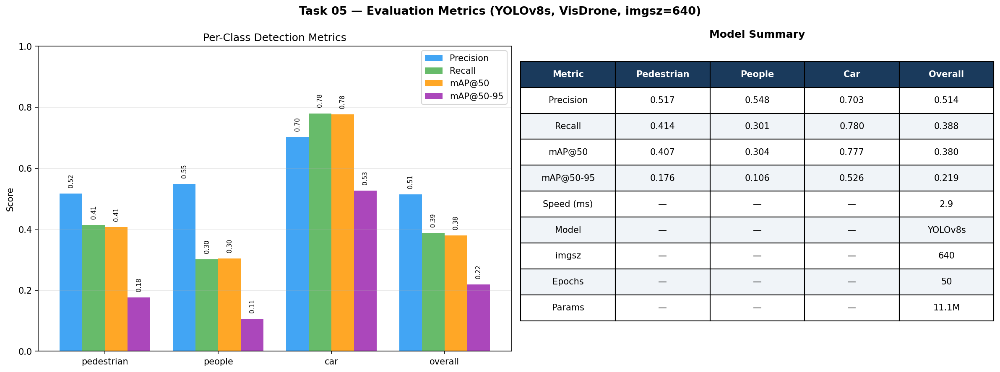

# Drone Human & Car Detection System
### ANTLINGS Internship Programme — Technical Assessment (AI/ML Track)

YOLOv8s fine-tuned on VisDrone2019 for drone-view human & car detection, counting, and ByteTrack multi-object tracking.

---

## Results

| Metric | Pedestrian | People | Car | Overall |
|--------|------------|--------|-----|---------|
| Precision | 0.517 | 0.548 | 0.703 | 0.514 |
| Recall | 0.414 | 0.301 | 0.780 | 0.388 |
| mAP@50 | 0.407 | 0.304 | 0.777 | 0.380 |
| mAP@50-95 | 0.176 | 0.106 | 0.526 | 0.219 |

**Model:** YOLOv8s — 11.1M parameters — 2.9ms inference — trained 50 epochs on Tesla T4

---

## Pipeline Overview

```
VisDrone2019 Dataset (6,471 train / 548 val images)
        ↓
  Dataset Analysis & Preprocessing (Task 01)
        ↓
  YOLOv8s Fine-tuning @ imgsz=640 (Task 02)
        ↓
  Human & Car Detection + Counting (Task 03)
        ↓
  ByteTrack Multi-Object Tracking (Task 04)
        ↓
  Evaluation & Analysis (Task 05)
```

---

## Dataset

**VisDrone2019-DET** — drone-captured imagery from Tianjin University, collected across 14 Chinese cities under varying conditions (altitude, weather, lighting, density).

- 6,471 training images, 343,205 bounding boxes
- 548 validation images, 38,759 bounding boxes
- 10 object classes: pedestrian, people, bicycle, car, van, truck, tricycle, awning-tricycle, bus, motor
- Labels shipped in YOLO format — no conversion required

**Key challenges identified:**
- Small object scale — humans appear as 5–15px at altitude
- Dense crowd occlusion — heavily packed scenes cause merged boxes
- Lighting variation — night scenes with artificial light cause missed detections
- Altitude-dependent appearance — top-down shots reduce humans to texture-less shapes

---

## Tasks

### Task 01 — Dataset Understanding & Preprocessing
- Analyzed class distribution across train/val splits
- Identified key challenges (scale, occlusion, lighting, altitude)
- Visualized ground truth annotations with color-coded bounding boxes
- Car dominates at 42.2% of annotations; combined human targets = 31%

### Task 02 — Model Training
- Fine-tuned YOLOv8s pretrained on COCO on all 10 VisDrone classes
- Trained at imgsz=640 with batch=16 for 50 epochs on Tesla T4 (Google Colab)
- Augmentation: mosaic, horizontal flip, HSV jitter, albumentations (blur, CLAHE)
- Cosine LR schedule; AdamW optimizer; early stopping with patience=10
- Best weights saved to Google Drive after each epoch

### Task 03 — Human & Car Detection with Counting
- Inference filters to pedestrian (cls 0), people (cls 1), car (cls 3)
- Bounding boxes drawn with class-specific colors
- Live count overlay displayed per image: `Humans: N | Cars: N`

### Task 04 — ByteTrack Multi-Object Tracking *(Bonus)*
- ByteTrack enabled via Ultralytics one-liner — `model.track(..., tracker="bytetrack.yaml")`
- Tested on sequence 0000295 (13 consecutive drone frames, highest annotation density in val set)
- 105 unique track IDs assigned; same color = same object identity across frames
- ByteTrack uses Kalman filter motion prediction + IoU matching to persist IDs through occlusion

### Task 05 — Evaluation & Analysis
- Car detection is the strongest performer: mAP@50 = 0.777, recall = 0.780
- Pedestrian moderate: precision/recall balanced at ~0.51/0.41
- People weakest: label ambiguity with pedestrian class suppresses recall to 0.301
- Full per-class metrics, training curves, and model summary visualized

---

## Sample Outputs

| Task | Output |
|------|--------|
| Task 01 — Ground Truth Samples |  |
| Task 02 — Model Predictions |  |
| Task 03 — Detection & Counting |  |
| Task 04 — ByteTrack Tracking |  |
| Task 05 — Evaluation Metrics |  |

---

## Repository Structure

```
antlings-visdrone-detection/
├── Obidit_Antlings_Assessment_Colab.ipynb   # Training notebook (run on Colab)
├── Obidit_Antlings_Assessment_Local.ipynb   # Inference & visualization notebook
├── best.pt                                   # Trained YOLOv8s weights
├── outputs/
│   ├── task01_samples.png
│   ├── task02_predictions.png
│   ├── task03_detection.png
│   ├── task04_tracking.png
│   └── task05_metrics.png
└── README.md
```

---

## Setup & Usage

**Requirements:**
```bash
pip install ultralytics opencv-python matplotlib
```

**Download dataset:**
```bash
kaggle datasets download -d banuprasadb/visdrone-dataset
unzip visdrone-dataset.zip -d visdrone
```

**Run inference on an image:**
```python
from ultralytics import YOLO
model = YOLO("best.pt")
results = model("your_image.jpg", imgsz=640, conf=0.25)
results[0].show()
```

**Run with ByteTrack tracking on a sequence:**
```python
results = model.track("your_image.jpg", imgsz=640, conf=0.25,
                       tracker="bytetrack.yaml", persist=True)
```

**Reproduce full pipeline:**  
Open `Obidit_Antlings_Assessment_Local.ipynb` and run all cells top to bottom with `best.pt` in the same directory.

---

## Training Configuration

| Parameter | Value |
|-----------|-------|
| Base model | YOLOv8s (COCO pretrained) |
| Dataset | VisDrone2019-DET |
| Classes | 10 (all original VisDrone classes) |
| Image size | 640 |
| Batch size | 16 |
| Epochs | 50 |
| Optimizer | AdamW (lr=0.000714) |
| LR schedule | Cosine |
| Hardware | Tesla T4 (Google Colab) |
| Training time | ~2.5 hours |

---

## What I Would Do With More Time

1. **Train at imgsz=1280** — highest-leverage change, estimated +8–12% mAP on small objects by preserving human pixel detail
2. **Merge pedestrian + people into a single human class** — eliminates label ambiguity, likely recovers 5–8% recall
3. **Apply SAHI** (Slicing Aided Hyper Inference) — tiles images into overlapping patches before inference, dramatically improves small object recall without retraining
4. **Upgrade to YOLOv8m** — 25M params vs 11M, estimated +3–5% overall mAP

---

## Author

**Obidit Islam**  
BSc Computer Science & Engineering, Islamic University of Technology  
[GitHub](https://github.com/tashobi02) · [LinkedIn](https://linkedin.com/in/obidit-islam-a74249212)